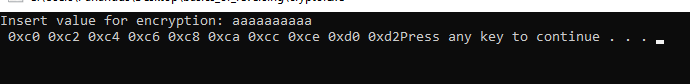
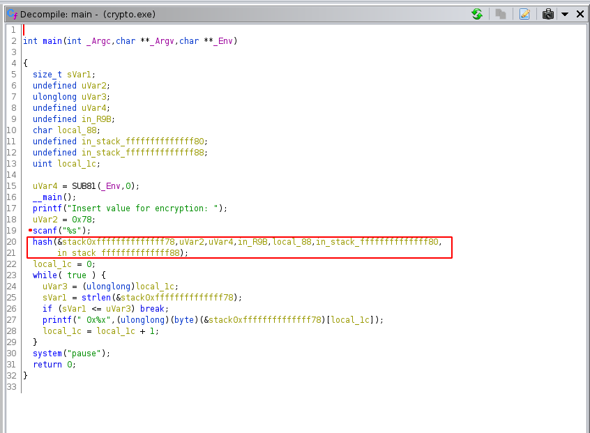
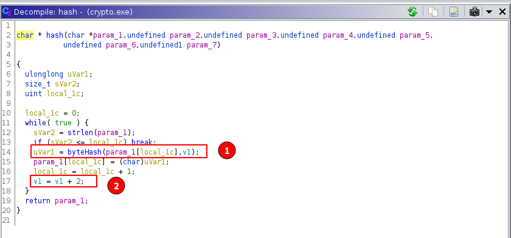
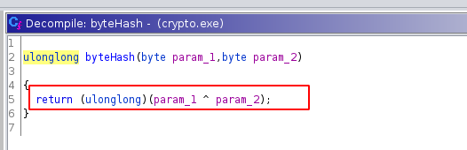
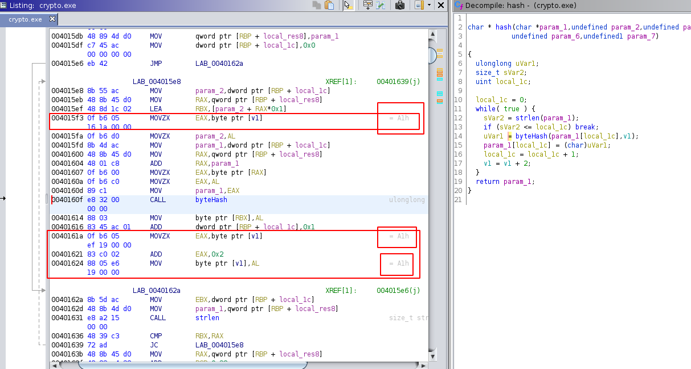
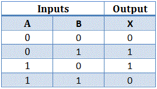

# PCTF 2020: Basics of Reversing
  


[](https://twitter.com/AcerCTF)

## Description
Our sofware engineer came up with this new revolutionary encryption algorithim and he used it to secure the flag. You have been given the encrypted flag and the application that was used to encrypt it.

Use your reverse engineering skills. Find out how the binary encrypted the flag and use that knowledge to decrypt it.

Flag will be in format: CC##-####-####-####

## Attached files
- [crypto.exe](/PCTF/basics_of_reversing/crypto.exe)
- [encrypted](/PCTF/basics_of_reversing/encrypted)

## Summary
XOR Cipher where the key must be obtained via reversing, debugging or brute-forcing.

## Flag
```
CC20-Ab6Y-XiK4-hFqW
```

# Detailed solution
## Initial Analysis
We are given an exe and another file containing 19 hex values which neatly corresponds to the **flag-format** given in the description. Opening the executable we are asked for text input which gets converted into hex values as can be seen below.



From observing this we can conclude that:
  1. Each ASCII character gets converted to a hexadecimal value (1-1 relation).
  2. The key seems to be incremented after each character (a = a => 0xc0 != 0xc2).
  3. The first **a** is always 0xc0, meaning that the key start is hard-coded.

There is a way, however, to solve this challenge without reverse-engineering anything and simply assuming XOR cipher which will be detailed in the bonus section.

## Reversing the executable using Ghidra
Experienced CTF players will intuitively already guess, that probably [XOR](https://en.wikipedia.org/wiki/XOR_cipher) is at play here but we can verify by conducting static analysis on the executable using [Ghidra](https://ghidra-sre.org/). We can use the string ( `Insert value for encryption:` ) to find the main function of the application. Ghidra will attempt to decompile the main function for us.




## The Hash Function
The **hash** function specifically seems to do the heavy lifting so we investigate further. We also note, that a reference is being passed to the hash function, which is most likely our string input. Lets take a look at the has function.



Ghidra tells us that each of our input characters is being, 1 by 1, passed into the **byteHash** function. Remember, that **param_1** was our string input, this is further verified because Ghidra types it as a char pointer.
We also notice that the second value being passed to the byteHash function, **v1** is incremented by 2 after each iteration of the loop, which is what we also noticed during our initial analysis. Lets also look at the byteHash function itself.



The **^** denotes an XOR operation between two bytes, which is what we suspected at the beginning. The cool thing about XOR though, is that it is reversable, meaning that: [ ` a ^ b = c ` and ` c ^ b = a ` ], in our case this would mean that [ ` "a" ^ v1 = 0xc0 ` and ` 0xc0 ^ v1 = "a" ` ]. But what is this **v1**, the inital key value that gets incremented by 2 after each loop iteration? Well Ghidra actually tells us.



The inital value of **v1** is **0xA1**. Meaning that [ ` "a" ^ 0xA1 = 0xc0 ` and ` 0xc0 ^ 0xA1 = "a" ` ], also meaning that [ ` 0xe2 ^ 0xA1 = "C" ` and ` 0xe0 ^ 0xA3 = "C" ` ], as we know that the first two characters of the flag are "**C**" from the flag format. Knowing this we can now write a Python script that will find us the flag, which can be found [here](/PCTF/basics_of_reversing/decryption.py).


## Bonus Solution
intuitively guessing the XOR cipher and noticing the +2 incrementation for each character we can simply use our own input to find the initial key value via **XOR Truth Table** without needing to use Ghidra.




| Character | Hex-Value | Binary-Value |
| ----------- | ----------- | ------- |
| a | 0x61 | 01100001 |
| v1 | unknown | unknown |
| a ^ v1 | 0xc0 | 11000000 |

We have the initial binary value, we have the resulting binary value, we can calculate using the truth table what the XOR value would have to be to end up with **0xc0** or **11000000**. The first initial bit is **0**, the only way the resulting first bit can be **1** is if the XOR value's first bit is **1**, as `0 XOR 1 = 1` according to the table.

| XOR | 
| --------- |
|  01100001 |
|  10100001 |
|  11000000 |

Therefore we arrive at **10100001** == **0xA1** :)